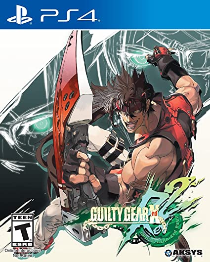

[link to the Wikipédia page](https://en.wikipedia.org/wiki/Guilty_Gear_Xrd)

[comment]: <> (I chose a Wikipedia page in english, so I wrote the entire assignment in english, I hope you don't mind.)

[comment]: <> (Additions for the assigment that are not in the original wikipedia page are bellow and stop at the first horizontal line.)

>Guilty Gear Xrd is a tough game, *Jacob* *Thibault*
>
>Guilty Gear Strive, the latest title, is easier, *Jacob* *Thibault*
```
#include <iostream>
Int main() {
  Std::cout << “Sol Badguy is the main character”
  return 0
{
```


`cout << “The name of the guy on the local image is Sol Badguy”.`
- 1
- 2
- 3 GO
-----------------------------------------------------------------


# **Guilty Gear Xrd**
From Wikipedia, the free encyclopedia

[**Contents**] hide

1. Gameplay
2. Synopsis
    3. Plot
    4. Characters
3. Development 
4. Release
5. Reception
6. Other media
7. See also
8. Notes
9. References
10. External links
    
[^1]***Guilty*** ***Gear*** ***Xrd***[^2] is a fighting video game sub-series by Arc System Works and part of the Guilty Gear series. *Guilty Gear Xrd* was developed using Unreal Engine 3, with cel-shaded graphics in place of the series traditional hand drawn sprites. Following the storyline of the last game in the series, *Guilty Gear 2: Overture*, it introduced seven new characters.

The first *Xrd* game, *Guilty Gear Xrd Sign*, was released in arcades on February 20, 2014, as the 5th main installment, and for the PlayStation 3 and PlayStation 4 in Japan and North America in December of the same year. A digital-only release happened in Europe in June 2015, and it was brought to Microsoft Windows via Steam on December 9, 2015. The game has been praised for its cel-shaded graphics and approachable gameplay, but criticized for its non-interactive story mode and smaller roster of characters.

A sequel follow-up[^3] titled *Guilty Gear Xrd* Revelator, was released on consoles in May 2016 in Japan and June 2016 elsewhere as the 6th main installment. An update title to *Revelator* titled *Guilty Gear Xrd Rev 2* was announced at Arc System Works Fighting Game Award 2016 on January 14, 2017, and released for Arcades in March 2017, while PS3, PS4 and PC versions were released worldwide at the end of May 2017. The Rev 2 update patch for those who bought Revelator on PlayStation Store or Steam was released as a paid DLC. The PS4 also received an exclusive physical disc version.[^9] 

### **Guilty Gear Xrd**


Textless cover of the home console versions

..

## **Gameplay**
See also: [Gameplay in the Guilty Gear series](https://en.wikipedia.org/wiki/Guilty_Gear#Gameplay)

The game uses a six-button layout: five of which are responsible for the attacks—punch, kick, slash, heavy slash and dust—, and the other one for taunting or respecting the other player. There are several other techniques which are triggered when two or three buttons are pressed simultaneously.[^10] A burst gauge is filled as time goes by or when the player receives damage; once the gauge is filled, the player can perform a Psych Burst to move away from the opponent. It unleashes a blast of energy that, if it successfully hits the adversary, completely charges another gauge, the tension gauge. The tension gauge allows the player to perform certain other special attacks.[^11]

### **References** [edit]

[^1]:Japanese:_ ギルティギア イグザード, Hepburn: Giruti Gia Iguzādo

[^2]:The "Xrd" is pronounced as "Ex Ard"

[^3]:Some sources referred to it as an "update" or a new version of Sign, while others called it a new installment

[^9]:GUILTY GEAR XRD REV 2(ギルティギア イグザード レヴ ツー)』が発表！ 梅喧＆アンサーの登場やロケテストの開催も明らかに".

[^10]: "GGXRD-R2/Movement - Dustloop Wiki". Dustloop. Retrieved 25 June 2021.

[^11]:Sato (August 8, 2013). "Guilty Gear Xrd -SIGN- Retains Old Moves, And Adds Plenty Of New Ones". Siliconera. Retrieved May 30, 2015.


